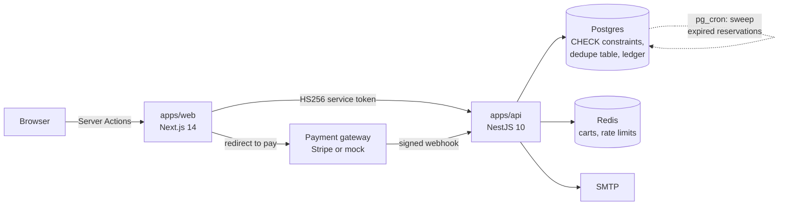

# Shop

An e-commerce store built around two guarantees that most demo stores quietly do
not have:

1. **A payment webhook can be delivered twenty times and the order is charged,
   shipped and emailed exactly once.**
2. **Twenty buyers can race for the last three units and exactly three of them
   win.** No oversell is reachable, by construction.

Everything else here (catalog, search, cart, checkout, admin panel, stock ledger)
exists so those two properties have somewhere real to live.

---

## The two hard problems

### Inventory consistency under concurrency

Three layers, strongest first.

**Layer 1 — a database CHECK constraint.** The hard guarantee, in
`packages/db/prisma/migrations/*_stock_invariants/migration.sql`:

```sql
ALTER TABLE "product_variants"
  ADD CONSTRAINT "variant_stock_non_negative"
  CHECK ("stock_on_hand" >= 0
     AND "stock_reserved" >= 0
     AND "stock_reserved" <= "stock_on_hand");
```

Overselling is structurally unreachable. No code path, however buggy, can commit
a state where reserved exceeds on-hand. An integration test asserts this by
issuing a hand-written `UPDATE` in psql and watching Postgres refuse it.

**Layer 2 — a conditional UPDATE, never a read-modify-write.** The availability
test *is* the `WHERE` clause, so there is no window between checking and writing:

```sql
UPDATE "product_variants"
   SET "stock_reserved" = "stock_reserved" + $qty
 WHERE "id" = $id
   AND "stock_on_hand" - "stock_reserved" >= $qty;
```

Zero rows affected means the stock was gone. `SELECT` then `if (stock >= qty)`
then `UPDATE` is a lost update waiting to happen: two transactions both read 3,
both decide 3 >= 3, and READ COMMITTED lets both commit.

Variants are always locked in a deterministic order (sorted by id), so two orders
holding the same two variants cannot deadlock. `apps/api/src/inventory/inventory.service.ts`.

**Layer 3 — an append-only stock ledger.** One row per movement (`RESERVE`,
`RELEASE`, `FULFILL`, `RESTOCK`, `ADJUST`) with signed deltas. Summing a
variant's ledger reconstructs its counters from zero; the integration suite
asserts they match, which is how a write that bypassed the service would be
caught.

Reservations carry a TTL, reclaimed two ways and by no background process.
`ReservationSweepService` runs at the start of every checkout — the only moment
a stale reservation actually costs anything is when it stands between a customer
and stock they want, and that is exactly when this fires. A `pg_cron` job runs
the same guarded statements inside the database, so orders still reach `EXPIRED`
with zero traffic. Neither needs a process to be running, which is what makes
the whole application deployable to a serverless host for nothing.

### Idempotent payment webhooks

**Layer 1 — the dedupe table's primary key.** Ingest is
`INSERT ... ON CONFLICT (provider, event_id) DO NOTHING`. A duplicate inserts
zero rows and is acknowledged without processing.

`if (await findEvent(id)) return;` races: two concurrent deliveries both find
nothing and both proceed. A primary key cannot race, because uniqueness is
enforced by the index at write time rather than by application code at read time.

**Layer 2 — a guarded state transition.**
`UPDATE orders SET status='PAID' WHERE id=$1 AND status='PENDING'`, in the same
transaction as the stock fulfilment and the ledger rows. A replay that somehow
slips past layer 1 still cannot decrement stock twice.

**Layer 3 — out-of-order tolerance.** An event for an order that does not exist
gets a retryable 503 (acknowledging would drop a real payment on the floor). An
event for a terminal order is acknowledged and ignored. A bad signature gets 400,
never 5xx, because it will never become good on a retry.

The whole thing is one transaction, so a failure rolls the dedupe row back with
it and the provider's retry is reprocessed rather than swallowed as a duplicate.
`apps/api/src/webhooks/webhooks.service.ts`.

---

## Architecture



The web app never talks to the database and never holds a payment key. It holds
the session, mints a five-minute service token, and calls the API. The API holds
every invariant.

```
apps/web/          Next.js 14 — storefront (ISR) + admin panel
apps/api/          NestJS 10 — catalog, cart, checkout, webhooks, admin, /health
packages/config/   Shared tsconfig (CJS + decorators for Nest, ESM for web)
packages/db/       Prisma schema, migrations, seed
packages/shared/   Zod contracts + pure domain logic (pricing, stock maths)
services/payments/ PaymentGateway contract: stripe driver + mock driver
services/storage/  StorageDriver contract: local-disk + s3 drivers
services/notifications/  Order emails (SMTP + log channel)
e2e/               Playwright
infra/             docker-compose + Dockerfiles
```

**Money is an integer number of cents everywhere.** No float touches a price.
`packages/shared/src/cart/pricing.ts` is pure and exhaustively unit-tested, and
it is the only place a total is computed, so the cart, the checkout and the
gateway can never disagree.

**Contracts live in `packages/shared`.** One Zod schema per payload, imported by
both sides of every call. The API validates with it and the web app validates
the same forms with it, so the two cannot drift apart.

### The pluggable payment gateway

`PAYMENTS_DRIVER=stripe|mock`. The Stripe driver is the only file that imports
`stripe`; everything upstream sees `PaymentGateway` and `ParsedWebhook`.

The mock driver is a real gateway in every respect except that it never moves
money: it issues session ids, hosts a checkout page, and posts back
HMAC-SHA256-signed webhooks using Stripe's own `t=<unix>,v1=<hex>` header format
over `${timestamp}.${body}`.

It exists because the idempotency guarantee has to be **provable in CI**, and it
cannot be if proving it depends on a third party's retry scheduler. The mock page
can deliver the same event twenty times concurrently, replay an event id, or
deliver an event for an order that no longer exists — on demand, with no network
and no tunnel. The endpoint for the inactive driver rejects everything, and an
E2E test asserts the mock checkout page 404s unless `PAYMENTS_DRIVER=mock`.

---

## Running it

Requires Node 20+, pnpm 9, and Docker.

```bash
cp .env.example .env
# AUTH_SECRET must be set (>= 16 chars):
sed -i "s|^AUTH_SECRET=|AUTH_SECRET=$(openssl rand -base64 32)|" .env

docker compose -f infra/docker-compose.yml up -d   # Postgres :5433, Redis :6380, Mailhog :8026
pnpm install
pnpm db:generate && pnpm db:deploy && pnpm db:seed
pnpm dev                                            # web :3000, api :4000
```

Ports are deliberately off the defaults (Postgres on 5433, Redis on 6380) so the
stack does not collide with a system Postgres or another project's containers.
The compose project is named `shop` for the same reason: every project in this
portfolio has an `infra/` directory, and without an explicit name Compose derives
the project name from it and two stacks evict each other.

Seeded logins, both with password `password123`:

| Email | Role |
|---|---|
| `admin@shop.local` | ADMIN |
| `customer@shop.local` | CUSTOMER |

To run the whole thing as it ships, in containers:

```bash
docker compose -f infra/docker-compose.yml --profile app up -d --build
```

---

## Tests

Three lanes, three budgets.

```bash
pnpm lint && pnpm typecheck && pnpm test   # gate: 288 unit tests, no I/O, ~2s
./scripts/integration.sh                   # 29 tests against real Postgres + Redis
./scripts/e2e.sh                           # 26 Playwright specs x 2 browsers
```

**Gate (Vitest).** Pricing maths, stock predicates, webhook event mapping, HMAC
signing and verification, upload validation, guards, config parsing, the
reservation sweep's control flow. Pure and fast; no database, no network.

**Integration.** The two proofs, against a real Postgres, because the properties
under test *are* Postgres properties: a conditional UPDATE's rowcount, a primary
key's behaviour under concurrent insert, a CHECK constraint's refusal to commit.
Mocking the database here would test the mock's opinion of those.

- `inventory.concurrency.integration.test.ts` — 20 buyers race 3 units; exactly 3
  win, 17 get a clean 409, stock lands at 0 available, the ledger reconciles, and
  a raw oversell `UPDATE` is refused by the constraint.
- `webhook.idempotency.integration.test.ts` — the same event delivered 10x
  concurrently, replayed, delivered out of order, delivered for a terminal order,
  delivered unsigned, delivered tampered. Exactly one `PAID` transition, one
  stock decrement, one `Payment` row.
- `reservation-sweep.integration.test.ts` — expiry from both triggers. A paid
  order whose deadline passed is left alone; five concurrent sweeps release each
  unit once; three expired orders holding the same variant release all three.

**E2E (Playwright).** Browse, search, guest checkout through the mock gateway,
confirmation, admin product creation, stock adjustment with its ledger row, order
fulfilment, and two real browsers racing the last unit in stock.

The two scripts do the whole setup and teardown, and refuse to run if something
is already serving the ports, because a suite that silently talks to a stale
server reports on code that is no longer on disk.

---

## Notes on decisions that are easy to get wrong

**Order numbers come from a Postgres sequence**, not from application code.
`MAX(number)+1` races, a random string has no ordering, and a timestamp collides
within a millisecond. Gaps are expected and fine.

**A guest's confirmation link carries an HMAC access token**, not their email.
Without any token, order ids become a public feed of other people's addresses;
with an email in the query string, PII lands in browser history and every proxy
log on the way. `apps/api/src/orders/order-access-token.ts`.

**The cart stores variant ids and quantities only.** Prices, titles and stock are
resolved on every read. A cart that cached a price would charge yesterday's price.

**Catalog pages are ISR, availability is not.** Content is cached for a minute;
stock is fetched live by the client on the product page. A cached "1 left" about
a variant that sold out forty seconds ago is exactly the lie this project exists
not to tell. That also means the root layout must never call `cookies()`, so the
nav is a client component fed by one route handler.

**`consistent-type-imports` is disabled for the API.** NestJS resolves
constructor dependencies from `emitDecoratorMetadata`, and an `import type`
erases the class, so the metadata records `undefined`. The rule's autofix makes
that change happily and the result compiles cleanly and dies at boot.

**Stock changes are deltas, never absolute values.** Two admins setting "12" from
two tabs silently lose one edit; "+5" and "+3" both land.

**The `/health` endpoint actually checks its dependencies** and returns 503 when
Postgres or Redis is unreachable. A green health check in front of a dead
database is worse than no health check, because the first report then comes from
a customer.

---

## Environment

Every variable is documented in `.env.example`. The ones that matter:

| Variable | Default | Notes |
|---|---|---|
| `AUTH_SECRET` | — | Required, >= 16 chars. Signs sessions, service tokens and cart cookies. |
| `PAYMENTS_DRIVER` | `mock` | `stripe` requires `STRIPE_SECRET_KEY` and `STRIPE_WEBHOOK_SECRET`, and fails at boot without them rather than falling back. |
| `STORAGE_DRIVER` | `local` | `s3` requires `S3_BUCKET` and `S3_REGION`. |
| `RESERVATION_TTL_MINUTES` | `15` | How long a checkout holds stock. |
| `TAX_BASIS_POINTS` | `875` | 8.75%, applied to the subtotal only. |
| `RATE_LIMIT_CHECKOUT` | `30` | Per IP per minute. The test scripts raise this; production should not. |

No secret is ever committed. `gitleaks` runs as a pre-commit hook and as the
first CI job, and a finding blocks the push.

---

## Deploying

Vercel for both apps, Supabase for Postgres and images, Upstash for Redis. Free,
and with no always-on process anywhere — which is why the queue is gone.

`infra/DEPLOY.md` is the runbook. `infra/PORTFOLIO-STACK.md` is the same pattern
generalised, because this is the template the rest of the portfolio reuses.
